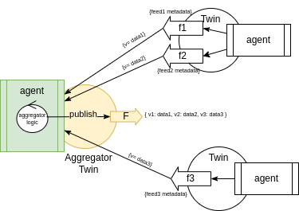

ifdef::env-github[]
:relfileprefix: 
:relfilesuffix: .adoc
xref:index.adoc[Index]
endif::[]

= Aggregator Twin

An aggregator twin has a feed that aggregates the values of multiple other feeds.

An aggregator twin is, in its own rights, a xref:{relfileprefix}the_brush{relfilesuffix}["brush" twin].

== When to use it

It may happen that, as part of modelling a solution, that multiple feeds, belonging to one or more twins, have a high cohesion, in that they represent either the same underlying state change or have common structural properties (for example, they emit at the same frequency or their semantic is described by the same ontology).
In this case, it's simpler for a consumer to manage a single subscription that delivers the values in one go.

== Related patterns

* xref:{relfileprefix}the_comb{relfilesuffix}[The Comb]
* xref:{relfileprefix}the_brush{relfilesuffix}[The Brush]
* xref:{relfileprefix}aggregator_twin{relfilesuffix}[Aggregator Twin]
* xref:{relfileprefix}synthesiser_twin{relfilesuffix}[Synthesiser Twin]
* xref:{relfileprefix}data_interaction_twin{relfilesuffix}[Data Interaction Twin]

