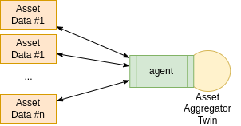

ifdef::env-github[]
:relfileprefix: 
:relfilesuffix: .adoc
xref:index.adoc[Index]
endif::[]

= Asset Aggregator Twin

An asset aggregator twin is a twin that aggregates data about an asset when such data is spread in a variety of systems owned by a single entity.
For example an enterprise may have data about an asset in the manufacturing database, in the ordering database, in the maintenance database. All these information can be aggregated into a single twin.

This differs from the xref:{relfileprefix}master_asset_twin{relfilesuffix}[Master Asset Twin] in that ownership of the underlying data is not spread across multiple organisations.

== When to use it

This pattern can used be to provide an abstraction layer and an asset focussed view of the data in those cases where accessing such data requires integrating with various systems with different APIs. The asset aggregator twin provides a single pane of glass into the asset, a normalised and reusable interface.

== Related patterns

* xref:{relfileprefix}asset_as_graph{relfilesuffix}[Asset as Graph]
* xref:{relfileprefix}master_asset_twin{relfilesuffix}[Master Asset Twin]
