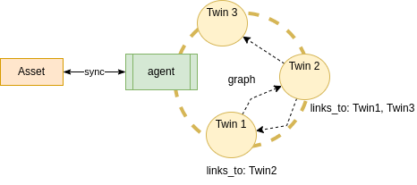

ifdef::env-github[]
:relfileprefix: 
:relfilesuffix: .adoc
xref:index.adoc[Index]
endif::[]

= Asset As Graph

An agent may represent an asset as a set of linked digital twins.

== When to use it

Complex assets may be represented as separate but semantically linked digital twins to provide better reusability and distinct access control rules.

== Related patterns

* xref:{relfileprefix}assets_as_twin{relfilesuffix}[Assets As Twin]

