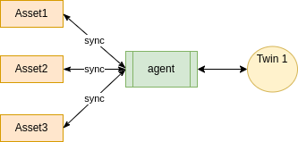

ifdef::env-github[]
:relfileprefix: 
:relfilesuffix: .adoc
xref:index.adoc[Index]
endif::[]

= Assets As Twin

An agent may represent multiple real assets as a single digital twin.
The digital twin may provide a single point of access to the data scattered in the assets or provide an abstraction.

== When to use it

A set of assets that work collaboratively in the real world may be represented as a single twin to provide a simpler interface.

== Related patterns

* xref:{relfileprefix}asset_as_graph{relfilesuffix}[Asset As Graph]

