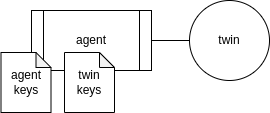
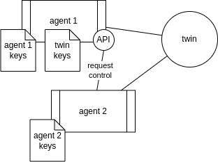
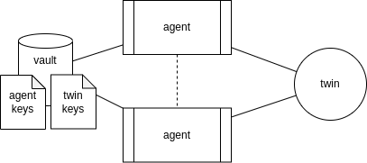
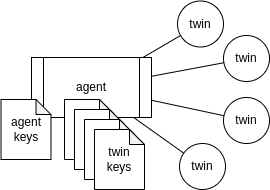

ifdef::env-github[]
:relfileprefix: 
:relfilesuffix: .adoc
xref:index.adoc[Index]
endif::[]

= Connector

The connector pattern refers to how agents accessing IOTICS are implemented.
In IOTICS, an agent has an identity (whose ID is represented by a W3C DID) which is authorised to authenticate on behalf of a user and to control a twin.
The mechanics follow https://docs.iotics.com/docs/identity[IOTICS DID specification].

A connector is an application that acts as an agent, therefore it owns keys that can control the identity document of an agent.
A connector can also create the identity of a twin and, as such, for all intents and purposes, be the twin.
With the keys at hand, the connector (or the twin it represents), can delegate other agents to control the twin itself.

Functionally, a connector, therefore implements the behaviour of the twin in that:

* it can control the twin's metadata
* it can publish on twin's feeds
* it can subscribe and process input requests

== Single tenanted connector

A single tenanted connector is an agent that manages a single twin.
The typical use case for this type of connector is the IoT device that controls its own identity and digital twin.

Although there will always be one twin per agent, it's still worthwhile to separate the identity of the twin from that of the agent so that agent identities can possibly change over time without affecting the identity of the twin.

== Single tenanted connector, multiple instances

Whilst the agent controlling the keys of the twin retains ultimate control over the twin's document, there may be the need to authorise other agents to control the twin.
In this case, the agent owning the key should expose some facility (like an API) to allow 3rd party agents to request control.
According to the IOTICS DID Spec, the request of control to the agent requires a proof.

== Single tenanted resilient connector

To provide  level  of resiliency to the twin's behaviour, agents may be deployed in a highly available mode.
The biggest distinction between a fully resilient agent and multiple instances of controlling agents (as described above) is that resilient agents' instances act synchronously to share the responsibility to manage the twin's state and behaviour.

Agents can be implemented using a variety of HA schemes: active/active or active/dr, with dr in cold or hot standby.
IOTICS (will) supports HA agents by providing features like consumer groups.

=== Access to keys to implement shared identity

Access to twin and agent keys can be implemented in a variety of ways, depending on the desired security profile.
Keys can, for example, be shared in a vault.
Alternatively - for testing and dev purposes, the keys' seed can be shared by all connectors.
Keys can then be re-generated on demand by each connector instance.

== Multi tenanted connector

For many use cases, it may be inefficient to have a single agent per twin, therefore it may be better to multi tenant twins within a connector.
Conceptually this doesn't change since there's still a 1-1 mapping between any given twin identity and an agent.

