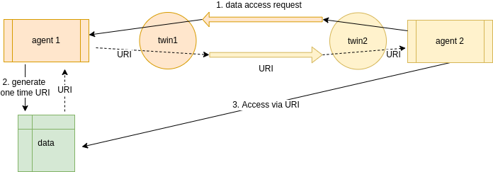

ifdef::env-github[]
:relfileprefix: 
:relfilesuffix: .adoc
xref:index.adoc[Index]
endif::[]

= Data Bypass

WARNING: This is work in progress and not yet supported by IOTICSpace.

Data bypass is a pattern https://www.eclipse.org/ditto/advanced-data-by-pass.html[introduced by Eclipse Ditto].
The idea is to provide access to data out-of-band in those situations where in-band transfer is not appropriate for performance or security reasons.

The mechanics work as follows:

. Agent of Twin 2 sends control command on a nominated input of Twin 1.
 ** The command models a request to the underlying data according to the semantic properties available in the input
 ** The sender must specify a _reply to_ input for the response to be replied to
. The request is relayed to the Twin 1's agent for processing
. The agent generates a one-time access URI for the incoming requestor
 ** This is specific to the internals of the data platform
. Agent of Twin 2 uses the one-time access token to access the data

== When to use it

It can be used to extend the features of a xref:{relfileprefix}dataset_twin{relfilesuffix}[Dataset Twin].
The actual data is transferred out-of-band but the interaction to get to the data is brokered according to the IOTICS rules.

== Alternatives

For small data sets, the data could be transferred in-band on the response channel.

== Related patterns

* xref:{relfileprefix}dataset_twin{relfilesuffix}[Dataset Twin]
