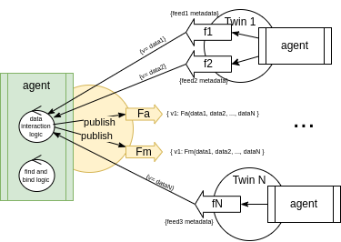
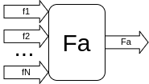

ifdef::env-github[]
:relfileprefix: 
:relfilesuffix: .adoc
xref:index.adoc[Index]
endif::[]

= Data Interaction Twin

A data interaction twin is a xref:{relfileprefix}synthesiser_twin{relfilesuffix}[Synthesiser Twin] which is also a dynamic variant of the xref:{relfileprefix}aggregator_twin[Aggregator Twin].
The dynamic aspect is provided by adopting xref:{relfileprefix}find_and_bind{relfilesuffix}[Find And Bind].

It follows that the generic data interaction component is made of two distinct parts, one dedicated to finding the right twins and feeds, the other to process the data coming from the followed twins.
The output of the processing published over a feed back into IOTICS: in fact, a data interaction may generate multiple feeds as the output of different processing units.

The find and bind part follows this algorithm:

* periodically run a search to find twins of interest
* compare the result of the search with the last successful search
 ** for each new twin found: follow all the feeds of interest
 ** for each known twin not found in the search: un-follow all its feeds

In the example in picture, the data interaction twin is following feeds F1 to FN, for each feed it's mapping the payloads `{v=data}` into m Feeds representing interaction function Fa to Fm. The generic F function maps the values in the payloads of F1..N into a single value. 

Or in more general terms, the processing of the inputs may be modelled as a function whose output is the value to be published in the mapped feed:

== When to use it

A data interaction is the most generic way to implement ELT pipelines into IOTICS where the outcome needs to be published back into IOTICS for others to consume.

== Related patterns

* xref:{relfileprefix}aggregator_twin{relfilesuffix}[Aggregator Twin]
* xref:{relfileprefix}synthesiser_twin{relfilesuffix}[Synthesiser Twin]
* xref:{relfileprefix}find_and_bind{relfilesuffix}[Find And Bind]

