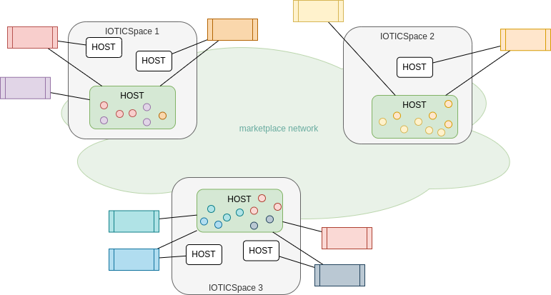

ifdef::env-github[]
:relfileprefix: 
:relfilesuffix: .adoc
xref:index.adoc[Index]
endif::[]

= Data marketplace

A data marketplace is an online place where data can be found and accessed under predefined conditions: data can be bought/sold, exchanged under predefined governance rules etc.
Access to the data marketplace can also be controlled.

With IOTICS a data marketplace is also an asset data marketplace.

In IOTICS a data marketplace is implemented by deploying hosts in a marketplace network.

Agents can manage twins in specific IOTICS Hosts dedicated to the marketplace.

== Related twins

* xref:{relfileprefix}twin_sharding{relfilesuffix}[Twin Sharding]
