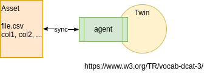

ifdef::env-github[]
:relfileprefix: 
:relfilesuffix: .adoc
xref:index.adoc[Index]
endif::[]

= Dataset Twin

Dataset twin is a twin with no feeds nor inputs.
It typically represents a dataset whose properties are represented as metadata.

A dataset twin can, most likely, be modelled with the https://www.w3.org/TR/vocab-dcat-3/[DCAT Ontology], an RDF vocabulary designed to facilitate interoperability between data catalogs published on the Web.

The dataset twin closely matches the concept of https://nanopub.org/wordpress/[Nanopublication].

A dataset twin may be extended with feeds to publish events representing changes to the dataset.

== When to use it

When dataset twins need to be made FAIR according to the https://www.go-fair.org/fair-principles/[FAIR data principles] via IOTICS.

== Related patterns

* xref:{relfileprefix}data_bypass{relfilesuffix}[Data Bypass]
* xref:{relfileprefix}versioned_dataset_twin{relfilesuffix}[Versioned Dataset Twin]

