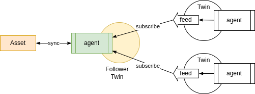

ifdef::env-github[]
:relfileprefix: 
:relfilesuffix: .adoc
xref:index.adoc[Index]
endif::[]

= Follower Twin

A follower twin is a twin that doesn't have feeds, may have inputs and exclusively subscribes to one or more feeds
from other twins for the purpose of receiving data.

Data may be processed by the agent before it's delivered to the asset.

== When to use it

A follower twin implements an ETL pipeline, subscribing to multiple data sources, processing the results and delivering it to the asset, for example a database.

== Related patterns

* xref:{relfileprefix}publisher_twin{relfilesuffix}[Publisher Twin]
* xref:{relfileprefix}synthesiser_twin{relfilesuffix}[Synthesiser Twin]
* xref:{relfileprefix}dataset_twin{relfilesuffix}[Dataset Twin]

