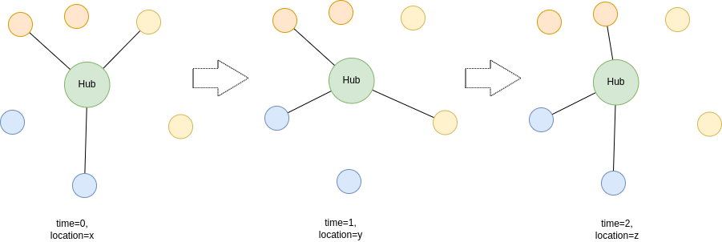

ifdef::env-github[]
:relfileprefix: 
:relfilesuffix: .adoc
xref:index.adoc[Index]
endif::[]

= Hub and spoke

Hub'n'spoke is an application pattern where the application is represented as a twin (or a class of twins) and the application use case it represents is fully implemented by that twin.

Every twin instance representing the "hub" uses xref:{relfileprefix}find_and_bind[find and bind], dynamically, to discover useful data over time and space: the found and bound twins may vary depending on time and location of the hub twin.

For example, the twin of an electric vehicle may need to find nearby compatible charging stations: the xref:{relfileprefix}find_and_bind{relfilesuffix}[Find And Bind] occurs periodically and the result varies depending on where the car is and what time the car needs the data.

== When to use it

This pattern is useful for those use cases where a twin (or class of twins) acts as the central entity for the use case.
As far as the use case, the hub behaves primarily as a xref:{relfileprefix}follower_twin{relfilesuffix}[Follower Twin], and the spokes as xref:{relfileprefix}publisher_twin{relfilesuffix}[Publisher Twin]s.

