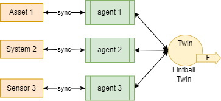

ifdef::env-github[]
:relfileprefix: 
:relfilesuffix: .adoc
xref:index.adoc[Index]
endif::[]

= Lintball Twin

A lintball twin is a twin that represents something about which the knowledge evolves over time in unpredictable ways.
The twin can have an event feed that gets shared every time the a new piece of "lint" gets added to the "ball".

== When to use it

Lintballs are good for event-based twins such as a https://en.wikipedia.org/wiki/Traffic_collision[Traffic Collision] or Road Traffic Accident. Create a twin when the accident happens and then add more metadata to it as more information becomes available.
For example, only the time and location of the accident may be known at the beginning, then add the people involved, the car registrations, the weather conditions, whatever becomes known. 
Any twin following the lintball's event feed can describe the twin when it receives the event to know the latest details. Or publish details in the event itself.

== Related patterns

* xref:{relfileprefix}publisher_twin{relfilesuffix}[Publisher Twin]
