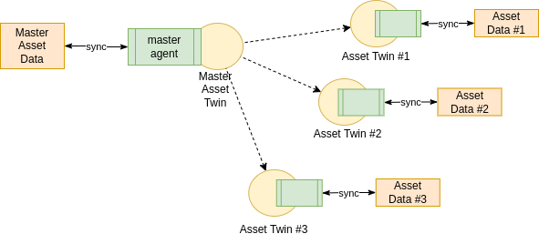

ifdef::env-github[]
:relfileprefix: 
:relfilesuffix: .adoc
xref:index.adoc[Index]
endif::[]

= Master Asset Twin

A master asset twin is a twin that acts as "master record" for an asset. It's very similar to xref:{relfileprefix}asset_as_graph{relfilesuffix}[Asset as Graph], the difference lies in the shape the "graph" takes. In this case the graph is mostly a "tree" with the master asset twin acting as the coordinating and root node linking to (and optionally from) the other twins. 

== When to use it

This pattern can be used when ownership of different (meta)data sets pertinent to the same asset varies. When the data is owned by a single entity, an Asset Aggregator Twin may be more appropriate.
When ownership is spread across multiple entities and access to the pieces of data isn't possible, each owner will create a digital twin of their own piece. A master asset twin then will act as an aggregator of all the other twins making the asset.

For example, a smart boiler installed in a domestic environment may have data owned by the owner of the house, some data in the manufacturer's database, some data in the installer database etc.  

A master asset twin works, then, as an index to link to the other twins, it provides an identity and a single entry point to browse the entirety of the data.

== Related patterns

* xref:{relfileprefix}asset_as_graph{relfilesuffix}[Asset as Graph]
* xref:{relfileprefix}asset_aggregator_twin{relfilesuffix}[Asset Aggregator Twin]
