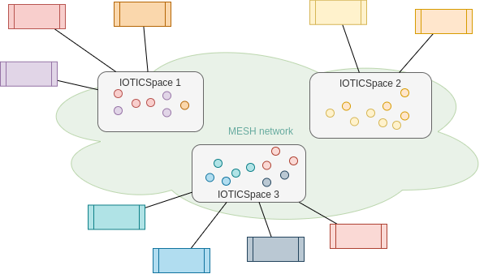

ifdef::env-github[]
:relfileprefix: 
:relfilesuffix: .adoc
xref:index.adoc[Index]
endif::[]

= Mesh

The mesh is the most generic application pattern for IOTICS Digital Twins. 

Each twin in the mesh is accessible to other twins based on the brokered interactions mechanics provided by IOTICS.

== When to use it

Each agent / application implements its use cases or, when multiple agents/twins cooperate they behave akin to multi-agent systems.

