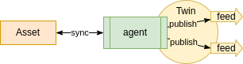

ifdef::env-github[]
:relfileprefix: 
:relfilesuffix: .adoc
xref:index.adoc[Index]
endif::[]

= Publisher Twin

A publisher twin is a twin that has feeds publishing data.
It doesn't have inputs to receive commands.
Nor does it follow other twins to synthesise any data.

== When to use it

* Use it when the underlying asset needs exclusively to broadcast data - i.e. not receive any data. (Use a xref:{relfileprefix}synthesiser_twin{relfilesuffix}[Synthesiser Twin] for this purpose)
* Any data source emitting data asynchronously can be modelled as a publisher.

== Related patterns

* xref:{relfileprefix}follower_twin{relfilesuffix}[Follower Twin]
* xref:{relfileprefix}synthesiser_twin{relfilesuffix}[Synthesiser Twin]
* xref:{relfileprefix}dataset_twin{relfilesuffix}[Dataset Twin]

