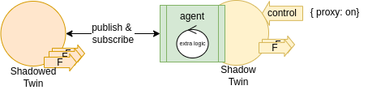

ifdef::env-github[]
:relfileprefix: 
:relfilesuffix: .adoc
xref:index.adoc[Index]
endif::[]

= Shadow Twin

A shadow twin replicates the data and metadata of another twin.

== When to use it

There are many cases when one may want to shadow another twin.

For example to provide a stub or a simulation of an existing twin:
the shadow can have an input interface to determine when to proxy to the real twin or when to behave as a stub.

Another example is to provide a twin that throttles or limits the data published:
a twin can be deployed on edge with feeds emitting at a large frequency for local followers;
a shadow twin can be deployed on edge to shadow the twin but with throttling behaviour
to limit the amount of data to remote followers.

Or, to simply re-deploy a new twin in a space or network without having to re-deploy the agent.

In the context of security, shadow twins can be used to partition security and access control to feeds selectively.

== Related patterns

* xref:{relfileprefix}synthesiser_twin{relfilesuffix}[Synthesiser Twin]

