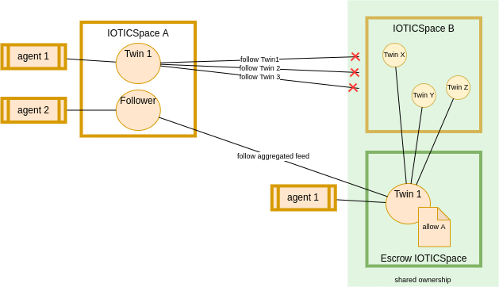

ifdef::env-github[]
:relfileprefix: 
:relfilesuffix: .adoc
xref:index.adoc[Index]
endif::[]

= Share Code

The share code pattern refers to the ability, in IOTICS, to bring code to the data, when data to the code isn't possible or desirable.
The essence of this pattern is to allow exposure of private data to algorithms and logic that extracts information, minimising the the risk of exposing or transferring such sensitive data.

The pattern leverages the "data centric" approach promoted by IOTICS, whereby data and metadata are semantically described and there's a single API to connect and integrate with.

In other contexts this pattern is also known as https://oceanprotocol.com/technology/compute-to-data[Compute-to-data].

== Description of the problem

Let's assume two IOTICSpaces A and B are part of an ecosystem and that, in order to collaborate, Twin 1 in IOTICSpace A needs an aggregation of data from Twin X, Twin Y and Twin Z in IOTICSpace B.

Owners of IOTICSpace B don't want to send data from their twins, but are happy for A to infer information obtained as a result of the aggregations.

== Description of the solution

An Escrow IOTICSpace (E) is setup by the owners of B to host Twin 1 (E may in fact be B, and not necessarily a separate space).
Owners of B can setup E's access control to allow A on Twin 1.
Moreover, Owners of B can vet "agent 1" and describe Twin 1 in E.
Agent 1 can seamlessly run in either A or E;
when running in E, agent 1 needs to manage an extra feed to send the aggregated data back to A via a follower twin purposefully provided to follow the aggregated data.

=== Positive side effects

Reduction on the size of data to transfer into A.

== When to use it

In many circumstances data may not be allowed to traverse some boundaries.

== Related patterns

* xref:{relfileprefix}follower_twin{relfilesuffix}[Follower Twin]
* xref:{relfileprefix}synthesiser_twin{relfilesuffix}[Synthesiser Twin]

