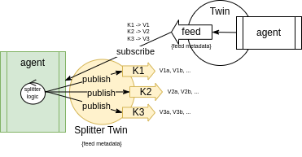

ifdef::env-github[]
:relfileprefix: 
:relfilesuffix: .adoc
xref:index.adoc[Index]
endif::[]

= Splitter Twin

Sometimes twins may end up being too complex and hard to reuse.
A splitter is a twin that maps a single feed of another twin into a set of feeds each publishing one of the values of the mapped feed.

A splitter twin is, in its own rights, both a  xref:{relfileprefix}publisher_twin{relfilesuffix}[Publisher Twin] and xref:{relfileprefix}the_comb{relfilesuffix}[Comb Twin].

== When to use it

It's useful to split another twin when the objective is to simplify the model and when it's desirable to enrich the specific feed data.
For example by modifying the sharing properties (by throttling, or by introducing an emission on a heartbeat) or by transforming the data.

A splitter is useful to decouple feed values when the level of cohesion between these values is low: the splitter in this case promotes the "single responsibility principle".

== Related patterns

* xref:{relfileprefix}publisher_twin{relfilesuffix}[Publisher Twin]
* xref:{relfileprefix}the_comb{relfilesuffix}[The Comb]
* xref:{relfileprefix}the_brush{relfilesuffix}[The Brush]
* xref:{relfileprefix}aggregator_twin{relfilesuffix}[Aggregator Twin]
