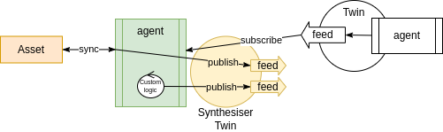

ifdef::env-github[]
:relfileprefix: 
:relfilesuffix: .adoc
xref:index.adoc[Index]
endif::[]

= Synthesiser Twin

A synthesiser is a twin that twins an asset but also manages one or more feeds with synthesised data.
This data is "synthetic" in the sense that it doesn't represent any state or change of state of the underlying asset, but it's generated by the agent following whatever custom logic.

== When to use it

Synthesisers can be used to provide extra functionality to an asset, for example, new feeds that work as aggregation of existing feeds.
Or for simulating status or status changes of the underlying asset, etc.
AI Algorithms work well as synthesiser twins

== Related patterns

* xref:{relfileprefix}follower_twin{relfilesuffix}[Follower Twin]
* xref:{relfileprefix}publisher_twin{relfilesuffix}[Publisher Twin]
* xref:{relfileprefix}dataset_twin{relfilesuffix}[Dataset Twin]
* xref:{relfileprefix}data_interaction_twin{relfilesuffix}[Data Interaction Twin]

