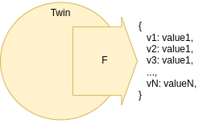

ifdef::env-github[]
:relfileprefix: 
:relfilesuffix: .adoc
xref:index.adoc[Index]
endif::[]

= The Brush

The brush is an approach in structuring twins one feed with a large payload.

== When to use it

Typical use of the brush to encapsulate into a single payload asset data that is highly cohesive and with the same structural properties (for example, the rate of change)

In some cases, when using an xref:{relfileprefix}aggregator_twin{relfilesuffix}[Aggregator Twin], the resulting aggregated feed can be modelled as a brush.

== Related patterns

* xref:{relfileprefix}the_comb{relfilesuffix}[The Comb]
* xref:{relfileprefix}splitter_twin{relfilesuffix}[Splitter Twin]
* xref:{relfileprefix}aggregator_twin{relfilesuffix}[Aggregator Twin]

