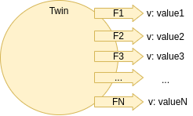

ifdef::env-github[]
:relfileprefix: 
:relfilesuffix: .adoc
xref:index.adoc[Index]
endif::[]

= The Comb

The comb is an approach in structuring twins with many feeds, where each feed has a single value.

== When to use it

Typical use of the comb is to represent an asset's internal status in variables that aren't necessarily highly correlated in how they change over time.
For example if the frequency of publishing is drastically different across the feeds.

In the most extreme cases one may think to "split" the twin into two.

== Related patterns

* xref:{relfileprefix}the_brush{relfilesuffix}[The Brush]
* xref:{relfileprefix}splitter_twin{relfilesuffix}[Splitter Twin]
* xref:{relfileprefix}aggregator_twin{relfilesuffix}[Aggregator Twin]

