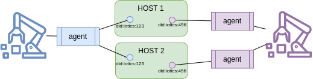

ifdef::env-github[]
:relfileprefix: 
:relfilesuffix: .adoc
xref:index.adoc[Index]
endif::[]

= Twin Resiliency

Access to twins' data relies on Host to provide access to the data and metadata. Leveraging the fact that twins have the semantic of reference - that is, two or more twins with the same identity are the same twin, irrespective of where they're deployed - resiliency may be achieved by providing access to the twin's asset data by means of multiple hosts.

Two modes are available

1. Singleton agent: the agent has the responsibility to maintain multiple copies of the same twin on multiple hosts
2. Resilient agent: separate agents take care of separate copies of the twin

xref:{relfileprefix}follower_twin{relfilesuffix}[Follower Twin]s can choose any twin with the same identity, knowing that they represent the same underlying asset with the caveat that data from both twin copies will be eventually consistent.

== When to use it

Use when access to data of an asset is critical and must be provided in a manner that is resilient to catastrophic failures of the host.

