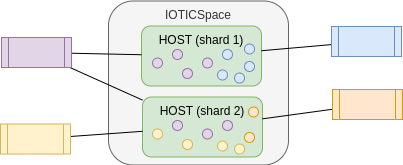

ifdef::env-github[]
:relfileprefix: 
:relfilesuffix: .adoc
xref:index.adoc[Index]
endif::[]

= Twin Sharding

Twin sharding is about partitioning twins in hosts within a space to leverage the physical security and centralisation characteristics of host. 

Sharding can be implemented by deploying agents on separate hosts depending on the business needs. For example:

* Apply different brokered interaction rules to group of twins. For example to allow access to some twins only from specific hosts but not others. 
* Implement separate governance policies by group of twins. For example to simplify implementation of data retention policies, etc.
* Comply to legal constraints. For example to comply to GDPR.
* Improve performance and minimise running costs of twins with different runtime characteristics. For example, twins with large amount of sharing data may be grouped separately from twin with small sharing footprint but large metadata / querying requirements.

It's legitimate, for an agent to shard twins on separate hosts.

== When to use it

Sharding can be used when twins and agents can be clearly separated according to physical constraints that can be mapped to each host.

