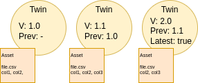

ifdef::env-github[]
:relfileprefix: 
:relfilesuffix: .adoc
xref:index.adoc[Index]
endif::[]

= Versioned Dataset Twin

Versioned Dataset twin is the twin of a dataset with two properties, one representing the value of the current version, the other, a link to the versioned dataset twin representing the previous version.
An optional third property may be specified as a flag to represent the "latest version".

Versioning can be represented with any ontology.
The DCAT ontology https://www.w3.org/TR/vocab-dcat-3/#dataset-versions[supports versioning].

== When to use it

When multiple versions of the same dataset must be kept alive and available for search.

== Related patterns

* xref:{relfileprefix}data_bypass{relfilesuffix}[Data Bypass]
* xref:{relfileprefix}dataset_twin{relfilesuffix}[Dataset Twin]

